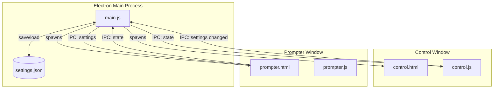

#  pmptr

[](https://github.com/jatinkrmalik/pmptr/releases)
[](https://github.com/jatinkrmalik/pmptr/actions/workflows/build.yml)
[](https://github.com/jatinkrmalik/pmptr/actions/workflows/release.yml)
[](https://github.com/jatinkrmalik/pmptr/actions/workflows/nightly.yml)
[](https://opensource.org/licenses/MIT)
[](https://github.com/jatinkrmalik/pmptr)
[](https://nodejs.org)
[](https://www.electronjs.org)

> **Beta** — pmptr is in active beta. Expect occasional bugs and breaking changes.
> Please [report issues](https://github.com/jatinkrmalik/pmptr/issues) you encounter.

A minimal virtual teleprompter that lives as a transparent, always-on-top,
click-through overlay over whatever you do on your screen.

## Download

Grab the latest build from the [Releases page](https://github.com/jatinkrmalik/pmptr/releases).

| Platform | Format |
|----------|--------|
| macOS    | `.dmg` |
| Windows  | `.exe` (NSIS installer) |
| Linux    | `.AppImage` or `.deb` |

Not code-signed — your OS may warn on first launch. That's expected during beta.

## Install from npm

If you have [Node.js](https://nodejs.org) installed, you can install `pmptr` globally and run it from your terminal:

```bash
npm install -g pmptr
pmptr
```

Requires Node.js **20** or later.

## Run from source

```bash
git clone https://github.com/jatinkrmalik/pmptr.git
cd pmptr
npm install
npm start
```

Then click **Open floating prompter** in the control window.

## Features

- **Control window** — paste your script, tune speed, size, colors, opacity, mirror,
  window dimensions, and more.
- **Floating prompter window** — transparent, frameless, always on top, with
  a true OS-level click-through "lock" so you can keep working with your mouse
  on whatever is underneath.
- Settings persist to disk in your Electron user-data folder.
- Live updates: edits in the control window apply to the prompter instantly.

## Shortcuts (in the floating window)

| Key       | Action                                  |
| --------- | --------------------------------------- |
| `Space`   | Play / pause                            |
| `R`       | Reset scroll to the top                 |
| `↑` / `↓` | Speed ± 5 px/s                          |
| `L`       | Toggle click-through (lock / unlock)   |
| `Esc`     | Close the prompter                      |

You can also use the small HUD in the bottom-right of the floating window
(mouse over it to reveal it).

## Architecture



The app runs in two Electron `BrowserWindow` instances that communicate
through IPC handlers in the main process. The control window is where you
paste your script and adjust settings; the prompter window is the
transparent, always-on-top overlay that scrolls the text. Settings are
persisted to `settings.json` in the Electron user-data directory.

## How the click-through works

The prompter is a separate `BrowserWindow` with `transparent: true`, `frame: false`,
and `alwaysOnTop: true`. When you toggle "click-through" (the lock), the main
process calls `win.setIgnoreMouseEvents(true, { forward: true })` — clicks
and wheel events fall straight through to whatever app is behind, while the
window stays visible and keeps scrolling. The HUD itself is hidden while
locked, so nothing on the prompter intercepts your pointer.

## Tweaking transparency

The window background is a CSS `rgba()` color set on `.frame`. Move the
**Background opacity** slider to 0 for fully see-through, or use
**Background dim** to keep it readable on bright content underneath. The text
itself stays opaque.

## Project layout

```
src/
├── main/
│   ├── main.js               Electron main: creates both windows, handles IPC,
│   │                         click-through, always-on-top, position presets.
│   └── preload.js            contextBridge for the control window.
├── control/
│   ├── control.html          The control panel UI.
│   ├── control.js            Control panel logic.
│   └── control.css           Control panel styles.
└── prompter/
    ├── prompter.html         The floating teleprompter overlay.
    ├── prompter.js           Prompter logic (scroll, shortcuts, HUD).
    ├── prompter.css          Prompter styles.
    └── prompter-preload.js   contextBridge for the prompter window.

assets/
└── icon.svg                  Application icon.

.github/workflows/
── build.yml                 CI build for Linux, macOS, Windows.
├── release.yml               Tag-triggered release pipeline.
├── nightly.yml               Daily scheduled builds.
└── pr-build.yml              Comment-triggered PR artifact builds.
```

## Development

```bash
# Install dependencies
npm install

# Run the app
npm start

# Lint code
npm run lint

# Run tests (currently just lint)
npm test

# Build for distribution
npm run build
```

## Known limitations

- Wayland compositors vary in their support for `setIgnoreMouseEvents` and
  `setAlwaysOnTop` (the underlying APIs Electron uses). X11 (Xorg) and recent
  KDE / GNOME Wayland work fine; some lighter Wayland compositors may ignore
  these hints. If click-through or always-on-top does not work, the prompter
  is still useful — just drag it to a corner.
- On macOS you may need to grant Accessibility / Screen Recording permissions
  to the app for click-through to behave predictably across all apps.
- The app is not code-signed. Your OS may warn on first launch.

## Contributing

Contributions are welcome! See [CONTRIBUTING.md](CONTRIBUTING.md) for details.

## License

MIT — see [LICENSE](LICENSE) for details.
